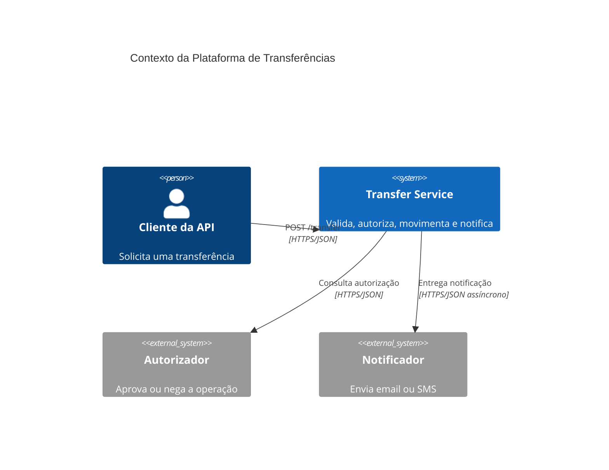
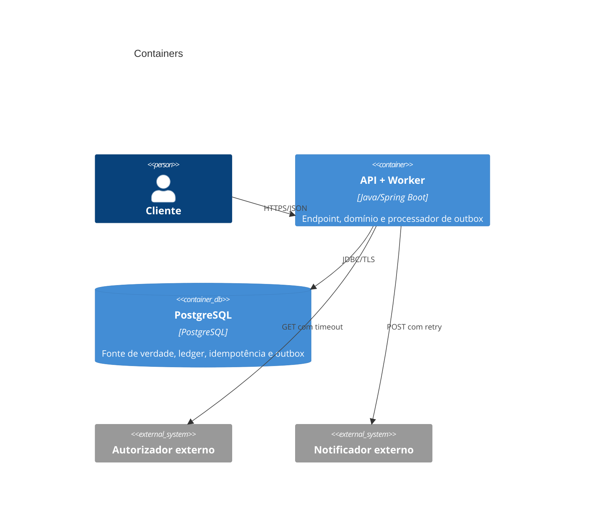
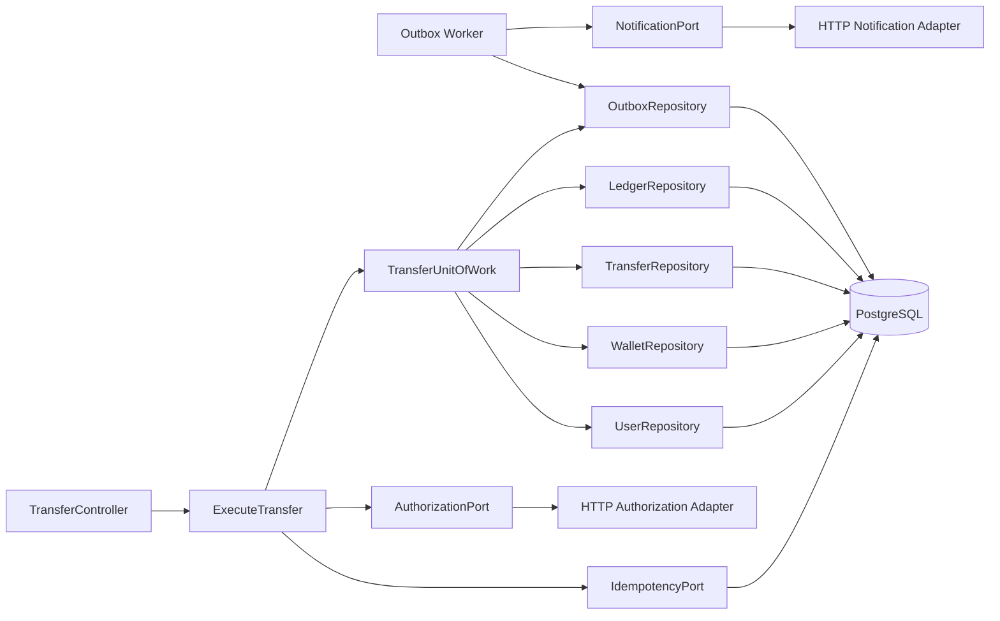
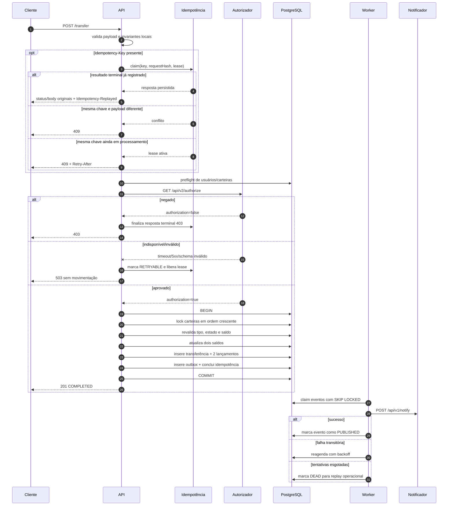
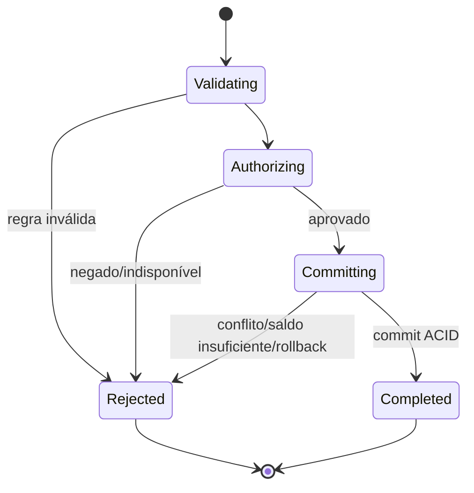
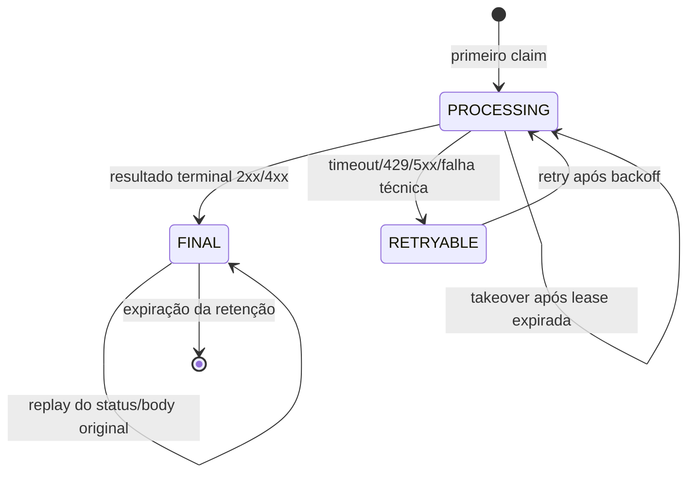
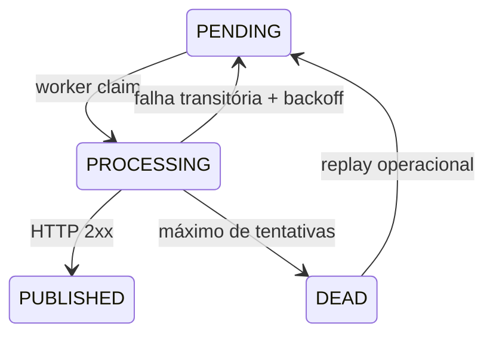

# Arquitetura da Solução

## 1. Estilo arquitetural

A solução adota um **monólito modular com arquitetura hexagonal**. Esse desenho mantém uma única unidade de deploy e uma única transação PostgreSQL, mas separa domínio, casos de uso e adapters. É mais simples e seguro para o desafio do que distribuir a transação entre microsserviços.

### Direção das dependências

```text
adapters/in  ──>  application  ──>  domain
adapters/out ──implements──> application ports
bootstrap    ──wires──> todos os módulos
```

- `domain` não conhece Spring, HTTP, JPA ou clientes externos;
- `application` orquestra casos de uso e declara portas;
- `adapters.in` traduz HTTP para comandos;
- `adapters.out` implementa PostgreSQL, autorizador e notificador;
- `bootstrap` concentra configuração e composição.

## 2. C4 — contexto



## 3. C4 — containers



API e worker começam no mesmo processo. O worker pode ser extraído e escalado separadamente sem alterar o domínio quando o volume justificar.

## 4. Componentes



## 5. Fluxo principal



## 6. Estados

### 6.1 Transferência

Somente transferências monetariamente concluídas são persistidas no MVP. Tentativas recusadas aparecem em logs/métricas e no registro idempotente, sem criar fato contábil.



### 6.2 Registro idempotente



`FINAL` não significa sucesso: representa qualquer resposta terminal reproduzível. Uma
falha transitória nunca fica presa em `PROCESSING`; ela passa a `RETRYABLE` e define
`next_retry_at`. Um crash é recuperado pelo vencimento da lease.

### 6.3 Evento de notificação



## 7. Algoritmo transacional

1. Validar JSON, campos, `Money`, IDs e chave idempotente; requests inválidos não
   criam claim.
2. Quando houver chave, criar/obter o claim em transação curta; reproduzir `FINAL`,
   rejeitar conflito/in-flight ou reabrir `RETRYABLE` elegível.
3. Validar pagador diferente do recebedor e fazer preflight sem lock para falhar
   rápido em casos óbvios; resultados de negócio após claim tornam-se `FINAL`.
4. Consultar o autorizador com timeout e circuit breaker. Falhar fechado.
5. Abrir transação PostgreSQL `READ COMMITTED`.
6. Buscar e bloquear as duas carteiras com `FOR UPDATE`, sempre em ordem de `user_id`.
7. Revalidar usuário ativo, tipo do pagador e saldo sob lock.
8. Aplicar débito e crédito usando `BigDecimal`.
9. Persistir transferência, dois lançamentos, evento outbox e resposta idempotente
   `FINAL` na mesma transação.
10. Commit; qualquer exceção faz rollback integral e classifica a chave como
    `RETRYABLE` quando o erro for transitório.

Resultados terminais anteriores ao movimento, como merchant pagador, recurso
inexistente ou autorização negada, finalizam a idempotência em uma transação curta.
Timeout, `429`, `5xx`, circuito aberto e falhas técnicas liberam retry com a mesma
chave após backoff.

O I/O do autorizador fica fora da transação para não manter locks durante uma chamada remota. A revalidação sob lock elimina a janela de corrida.

## 8. Estrutura de pacotes proposta

```text
src/main/java/com/example/transfers/
├── domain/
│   ├── model/          Money, User, Wallet, Transfer, LedgerEntry
│   ├── policy/         TransferPolicy
│   └── exception/      violações de domínio
├── application/
│   ├── port/in/        ExecuteTransferUseCase
│   ├── port/out/       repositories, authorization, notification, clock, ids
│   └── service/        ExecuteTransferService, OutboxPublisher
├── adapter/
│   ├── in/web/         controller, DTOs, problem details
│   └── out/
│       ├── persistence/ entidades e repositories JDBC/JPA
│       └── http/        authorizer e notifier
└── bootstrap/           configuração, observabilidade e scheduling
```

Testes espelham essa estrutura em `src/test` e testes com infraestrutura ficam em `src/integrationTest`.

## 9. Padrões aplicados

| Padrão | Uso |
|---|---|
| Ports and Adapters | desacoplar domínio de web, banco e terceiros |
| Repository | persistência atrás de interfaces orientadas ao domínio |
| Unit of Work | uma fronteira transacional para todos os efeitos monetários |
| Transactional Outbox | entrega eventual sem dual write |
| Idempotent Consumer/Request | evitar débito duplicado em retries |
| Circuit Breaker | conter falhas repetidas do autorizador/notificador |
| Value Object | representar `Money`, IDs e tipos sem primitive obsession |
| Problem Details | padronizar erros HTTP sem vazar internals |

## 10. Escalabilidade evolutiva

- várias instâncias da API compartilham PostgreSQL; locks preservam consistência;
- workers paralelos usam `FOR UPDATE SKIP LOCKED` e leases;
- réplicas de leitura podem atender consultas futuras, nunca validação de saldo;
- particionar `ledger_entries` e `outbox_events` por data somente após evidência de volume;
- extrair notificações para broker/serviço separado sem tocar na transação monetária;
- não introduzir cache para saldo, pois consistência vale mais que latência nesse fluxo.
