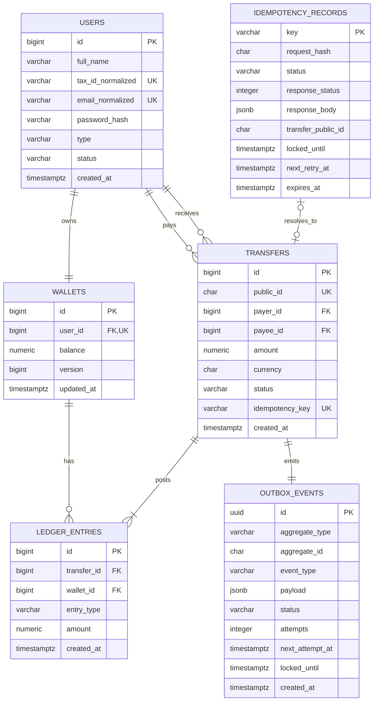

# Modelagem de Dados

## 1. Escolhas

- PostgreSQL 18 é a fonte de verdade transacional de referência.
- `NUMERIC(19,2)` representa BRL; `float` e `double` são proibidos para dinheiro.
- saldo em `wallets` é o snapshot operacional; `ledger_entries` é o histórico imutável.
- IDs internos usam `BIGINT`; a transferência expõe um ULID de 26 caracteres.
- todas as datas usam `TIMESTAMPTZ` em UTC.
- deleção física de fatos monetários é proibida.

## 2. Diagrama ER



## 3. Esquema lógico e constraints

### `users`

| Campo | Regra |
|---|---|
| `tax_id_normalized` | somente dígitos, único; valida CPF/CNPJ na borda |
| `email_normalized` | trim + lowercase, único |
| `password_hash` | Argon2id ou BCrypt; nunca texto puro |
| `type` | `CUSTOMER` ou `MERCHANT` |
| `status` | `ACTIVE` ou `BLOCKED` |

Índices únicos devem ser explícitos e nomes de constraint estáveis para tradução correta de conflitos.

### `wallets`

```sql
balance NUMERIC(19,2) NOT NULL DEFAULT 0 CHECK (balance >= 0)
```

`user_id` é único. A atualização usa lock pessimista e incrementa `version`, que auxilia diagnóstico e futuras estratégias otimistas.

### `transfers`

Constraints essenciais:

```sql
CHECK (amount > 0)
CHECK (payer_id <> payee_id)
CHECK (status = 'COMPLETED')
UNIQUE (public_id)
UNIQUE (idempotency_key) -- múltiplos NULL são aceitos no PostgreSQL
```

### `ledger_entries`

- `entry_type`: `DEBIT` ou `CREDIT`;
- `amount`: sempre positivo;
- `UNIQUE (transfer_id, entry_type)` garante no máximo um lançamento de cada tipo;
- um constraint trigger `DEFERRABLE INITIALLY DEFERRED` valida no commit exatamente
  um débito, um crédito, valores iguais e soma algébrica zero;
- o agregado de domínio cria o par completo antes da persistência;
- job de reconciliação verifica `credit - debit = 0` e compara ledger com snapshot.

Esboço da última linha de defesa:

```sql
CREATE CONSTRAINT TRIGGER ledger_entries_balanced
AFTER INSERT OR UPDATE OR DELETE ON ledger_entries
DEFERRABLE INITIALLY DEFERRED
FOR EACH ROW EXECUTE FUNCTION assert_transfer_ledger_balanced();
```

A função valida o `transfer_id` afetado no fim da transação. O usuário runtime não
possui permissão para desabilitar trigger, atualizar ou excluir lançamentos.

### `outbox_events`

- payload versionado, por exemplo `transfer.completed.v1`;
- claim atômico com `FOR UPDATE SKIP LOCKED`;
- índices em `(status, next_attempt_at)` e `locked_until`;
- retenção: publicados por 30 dias; mortos até resolução e depois 90 dias.

### `idempotency_records`

- `request_hash` é SHA-256 de um JSON canônico contendo valor, pagador e recebedor;
- `status`: `PROCESSING`, `FINAL` ou `RETRYABLE`;
- claim possui lease para recuperação após crash;
- `FINAL` persiste status, headers allowlisted e body exatos de resultados terminais
  `2xx/4xx` posteriores ao claim; erro sintático `400` não cria registro;
- `RETRYABLE` registra `next_retry_at`, motivo de baixa cardinalidade e quantidade de
  tentativas, permitindo novo claim atômico com a mesma chave;
- chave `PROCESSING` com lease ativa retorna conflito; lease expirada permite takeover;
- TTL sugerido de 24 horas no MVP; limpeza nunca remove registro em processamento.

## 4. Controle de concorrência

As carteiras são bloqueadas em ordem determinística, independentemente de quem paga:

```sql
SELECT id, user_id, balance
FROM wallets
WHERE user_id IN (:payer_id, :payee_id)
ORDER BY user_id
FOR UPDATE;
```

Essa abordagem:

- serializa débitos concorrentes da mesma carteira;
- evita saldo negativo por check-then-act;
- reduz deadlocks ao manter a mesma ordem global;
- permite transferências de carteiras distintas em paralelo.

Em caso de deadlock ainda detectado pelo PostgreSQL, a transação é repetida no máximo uma vez com jitter, desde que a intenção possua chave idempotente.

## 5. Fronteira ACID

Dentro de uma única transação:

1. lock e leitura das carteiras;
2. validação final do saldo;
3. atualização do saldo do pagador;
4. atualização do saldo do recebedor;
5. insert da transferência;
6. insert dos dois lançamentos;
7. insert do evento outbox;
8. conclusão do registro idempotente.

Falha em qualquer passo reverte todos os anteriores. A chamada ao autorizador ocorre antes; a chamada ao notificador ocorre depois, por worker.

## 6. Invariantes e reconciliação

| Invariante | Proteção online | Verificação offline |
|---|---|---|
| saldo nunca negativo | regra de domínio + lock + `CHECK` | query de saldos negativos |
| uma carteira por usuário | `UNIQUE` | contagem agrupada |
| transferência tem débito e crédito | agregado + unique + trigger diferido | contagem por transferência |
| soma contábil é zero | value object + trigger diferido | soma assinada por transferência |
| snapshot corresponde ao ledger | transação única | saldo inicial + lançamentos = snapshot |
| outbox existe para transferência | insert na mesma transação | anti-join transferência/outbox |

Uma divergência de reconciliação é incidente de severidade alta e nunca deve ser corrigida por `UPDATE` manual sem trilha auditável.

## 7. Migrações e dados de demonstração

- Flyway executa migrações versionadas, somente forward em produção.
- `V1__create_core_schema.sql` cria tabelas e constraints.
- `V2__create_outbox_and_idempotency.sql` cria mecanismos operacionais.
- fixtures de desenvolvimento usam profile explícito e nunca executam em produção.
- testes de integração aplicam as mesmas migrações em PostgreSQL Testcontainers.

## 8. Backup e retenção

- backups completos diários e WAL/PITR para RPO de até 5 minutos;
- teste trimestral de restore em ambiente isolado;
- ledger e transferências seguem retenção financeira definida pela organização;
- dados pessoais devem seguir política LGPD e pseudonimização; fatos financeiros não são apagados de modo destrutivo.
