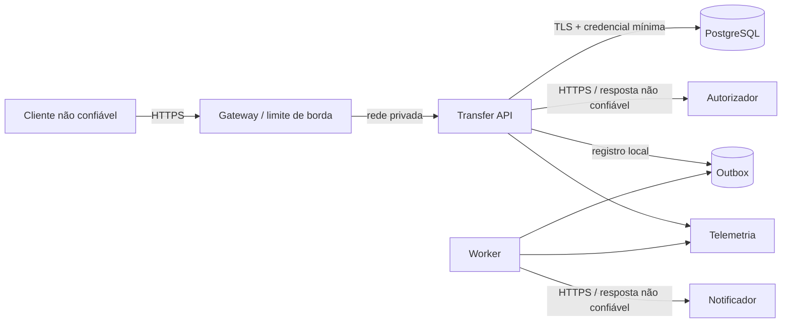

# Segurança e Threat Model

## 1. Escopo e premissas

O desafio exclui autenticação, mas isso não torna a API pública segura. Para a avaliação, o serviço roda em ambiente controlado com usuários provisionados. Em produção, um gateway autenticaria o cliente e o `payer` seria derivado da identidade/conta autorizada, nunca confiado diretamente do body.

Objetivos prioritários:

1. impedir movimentação não autorizada ou duplicada;
2. preservar integridade de saldos e ledger;
3. proteger PII, credenciais e detalhes internos;
4. conter abuso e falhas de dependências;
5. manter trilha suficiente para investigação sem registrar dados excessivos.

## 2. Ativos

- saldos, transferências e ledger;
- chaves idempotentes e identificadores de transação;
- CPF/CNPJ, e-mail, nome e hash de senha;
- credenciais do banco e integrações;
- código, imagem, pipeline e artefatos de build;
- logs, traces, backups e eventos de outbox.

## 3. Fronteiras de confiança

Tudo que cruza uma fronteira é validado, limitado e tratado como não confiável, inclusive respostas dos mocks.

## 4. STRIDE

| ID | Ameaça | Vetor | Risco | Controle principal | Verificação |
|---|---|---|---:|---|---|
| S-01 | falsificação de pagador | cliente informa ID de terceiro | crítico em produção | identidade autenticada vinculada à carteira; fora do MVP controlado | teste de autorização futuro |
| S-02 | falsificação de terceiro | DNS/TLS comprometido | alto | HTTPS, validação de certificado, allowlist de host, egress restrito | teste de config/scan |
| T-01 | débito duplicado | retry após timeout | alto | idempotência persistida e resposta replay | concorrência + E2E |
| T-02 | overspending | duas requisições concorrentes | crítico | lock ordenado, revalidação e check de saldo | teste PostgreSQL concorrente |
| T-03 | alteração do ledger | update/delete indevido | crítico | usuário DB mínimo, ledger imutável, auditoria e reconciliação | teste de permissão/reconciliação |
| T-04 | SQL injection | campos/headers manipulados | alto | parâmetros preparados e nenhum SQL concatenado | SAST + teste negativo |
| R-01 | negar autoria da operação | ausência de correlação | médio | idempotency/transfer/trace IDs e audit trail | assertions de log |
| I-01 | PII em logs | serialização de request/entidade | alto | allowlist e mascaramento; body logging desabilitado | teste de redaction |
| I-02 | detalhes internos em erro | exceção/stack trace | médio | Problem Details estável e handler genérico | testes API |
| I-03 | secrets em repo/imagem | arquivo ou layer | alto | secret scan, BuildKit secrets, OIDC, `.dockerignore` | Gitleaks/Trivy |
| D-01 | exaustão da API | payload/rate/slow client | alto | body/header limits, rate limit, timeouts e pool limitado | testes de abuso/carga |
| D-02 | cascata do autorizador | latência/5xx | alto | timeout, bulkhead e circuit breaker | fault injection |
| D-03 | crescimento da outbox | notificador indisponível | médio | retry limitado, DLQ, retenção e alerta de idade | integração + alerta |
| E-01 | escape de container | processo root/capabilities | alto | usuário não-root, read-only, cap drop, imagem mínima | scan de imagem/config |
| E-02 | privilégios excessivos DB | credencial dona do schema | alto | usuários separados de migration/runtime | teste de permissão |
| E-03 | dependência comprometida | supply chain | alto | lockfile, SCA, SBOM, assinatura e provenance | pipeline |

Nenhum risco crítico pode ser aceito silenciosamente. Riscos fora do MVP devem constar como limitação explícita na apresentação.

## 5. Controles de aplicação

### Entrada

- JSON máximo de 8 KiB para o endpoint;
- rejeitar campos desconhecidos;
- IDs positivos e dentro de `BIGINT`;
- valor positivo, limite de escala e teto configurável;
- headers de correlação/idempotência entre 8 e 128 caracteres e charset restrito;
- content type estrito e parser com profundidade/tamanho limitados;
- mensagens de validação não ecoam payload completo.

### Idempotência e replay

- hash SHA-256 sobre representação canônica;
- comparação em tempo constante quando tratar material sensível;
- chave nunca usada como autorização;
- TTL e rate limit por identidade/origem;
- conflito de payload não revela a resposta anterior.

### Erros

- catálogo fechado de códigos públicos;
- `INTERNAL_ERROR` para falhas inesperadas;
- stack trace somente na telemetria interna e sem dados sensíveis;
- respostas do PostgreSQL e terceiros nunca são repassadas integralmente.

### Banco

- queries parametrizadas;
- TLS em produção;
- credencial runtime sem `CREATE`, `ALTER`, `DROP` ou ownership;
- credencial de migration separada e usada apenas no deploy;
- backups criptografados e acesso auditado;
- constraints como última linha de defesa.

## 6. PII e LGPD

| Dado | Armazenamento | Log | Exposição API |
|---|---|---|---|
| CPF/CNPJ | normalizado; preferir criptografia/tokenização em produção | últimos 4 dígitos somente quando indispensável | nunca no fluxo de transferência |
| e-mail | normalizado; criptografia em repouso conforme plataforma | mascarado | nunca no response de transferência |
| nome | banco protegido | não registrar | nunca no response de transferência |
| senha | somente hash forte com salt | nunca | nunca |
| saldo/valor | banco/ledger | valor pode ser métrica agregada; evitar log individual | somente valor da própria operação |
| chave idempotente | banco com TTL | hash ou prefixo seguro | não ecoar |

Aplicar minimização, finalidade, retenção definida, controle de acesso e processo de atendimento ao titular. Exclusão de PII deve preservar obrigações legais do ledger por anonimização/pseudonimização, não apagar fatos financeiros sem governança.

## 7. Secrets

- ambiente local usa `.env.example` sem valores reais;
- CI/CD usa OIDC e secret manager, sem credenciais long-lived;
- rotação imediata após suspeita e periódica segundo política;
- secrets não entram em argumentos de build, labels, logs ou camadas Docker;
- startup falha quando secret obrigatório está ausente; nunca usa default inseguro.

## 8. Container e runtime

- imagem distroless/minimal pinada por digest no pipeline de release;
- usuário e grupo sem privilégio;
- filesystem read-only, `/tmp` com volume temporário e limite;
- `no-new-privileges`, capabilities removidas e seccomp padrão;
- limites de CPU/memória e heap consciente de container;
- actuator administrativo em porta/rede privada; somente health público quando necessário.

## 9. Supply chain e pipeline

- dependências travadas e verificadas;
- SAST, SCA, secret scan, IaC scan e image scan em toda PR;
- SBOM CycloneDX/SPDX por release;
- artefato construído uma vez e promovido entre ambientes;
- assinatura keyless e provenance do build;
- proteção de branch, revisão obrigatória e permissões mínimas do workflow;
- dependências `critical/high` bloqueiam merge, salvo exceção temporária documentada com prazo e compensação.

## 10. Checklist de review

- [ ] dinheiro não usa ponto flutuante;
- [ ] toda query é parametrizada;
- [ ] logs usam allowlist e não incluem bodies;
- [ ] erro externo falha fechado;
- [ ] operação monetária possui teste de concorrência/rollback;
- [ ] endpoint possui limites e rate limit;
- [ ] novas dependências passaram por SCA e justificativa;
- [ ] mudança de schema respeita menor privilégio e compatibilidade;
- [ ] ameaça nova foi adicionada ao threat model;
- [ ] nenhum secret ou dado real foi adicionado a fixtures.
