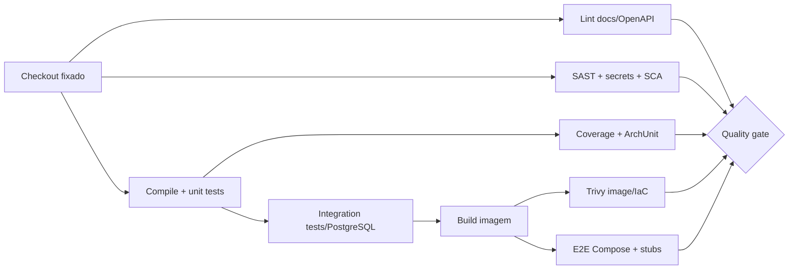

# CI/CD, Docker e Ambientes

## 1. Objetivos

- reproduzir localmente o mesmo build do CI;
- bloquear defeitos antes do merge;
- construir uma única imagem imutável por revisão;
- promover o mesmo digest entre ambientes;
- manter migrations e rollback seguros;
- não depender dos mocks públicos durante build ou testes.

## 2. Fluxo de branches

- branches curtas a partir de `main`;
- pull request obrigatório, ao menos uma revisão e checks protegidos;
- merge squash ou histórico linear conforme convenção;
- `main` sempre potencialmente liberável;
- tags semânticas criam releases; hotfix segue o mesmo pipeline.

## 3. Pipeline de pull request

Jobs independentes rodam em paralelo. O pipeline cancela execuções antigas da mesma PR e usa cache por checksum de lockfiles, nunca restaura artefatos executáveis de origem não confiável.

### Checks obrigatórios

1. formatter/lint e compilação com warnings tratados;
2. unit tests;
3. integration tests com PostgreSQL Testcontainers;
4. JaCoCo ≥ 95% de linhas e branches, 100% no núcleo crítico;
5. ArchUnit e análise estática;
6. lint/validação do OpenAPI e links da documentação;
7. SAST, secret scan e dependency scan;
8. Docker build e image/IaC scan;
9. E2E com Compose e WireMock;
10. mutation test em `main`/noturno, após estabilização.

## 4. Pipeline de release

1. usar o commit já validado;
2. construir imagem uma vez com build reproduzível;
3. gerar SBOM e provenance;
4. escanear novamente a imagem final;
5. assinar por identidade OIDC/keyless;
6. publicar por digest e tag imutável;
7. aplicar migrations compatíveis;
8. deploy canário/rolling com readiness;
9. smoke sintético sem dinheiro real;
10. promover ou fazer rollback automático.

Ambientes aprovam o **mesmo digest**. Nunca recompilar para produção.

## 5. Dockerfile alvo

- stage de build fixa JDK e valida checksum/lock de dependências;
- stage runtime contém apenas JRE necessário e aplicação;
- imagem base mínima pinada por digest no release;
- `USER` não-root;
- `ENTRYPOINT` em exec form;
- healthcheck ou probes no orquestrador;
- heap configurado por percentual de memória do container;
- nenhum source, cache, secret ou ferramenta de build no runtime;
- labels OCI para commit, versão, origem e SBOM.

## 6. Docker Compose local

Serviços:

| Serviço | Função | Dependência saudável |
|---|---|---|
| `api` | API e worker | `postgres`, `wiremock` |
| `postgres` | banco local | `pg_isready` |
| `wiremock` | stubs do autorizador/notificador | endpoint health |
| `otel-collector` opcional | telemetria local | endpoint health |

Volumes persistentes são opcionais em desenvolvimento e descartáveis no E2E. A rede do banco não é publicada fora do host quando desnecessário.

## 7. Configuração

Variáveis alvo:

| Variável | Descrição | Regra |
|---|---|---|
| `DATABASE_URL` | JDBC PostgreSQL | obrigatória |
| `DATABASE_USERNAME` | usuário runtime | obrigatória |
| `DATABASE_PASSWORD` | secret runtime | obrigatória, sem default |
| `AUTHORIZER_BASE_URL` | host allowlisted | obrigatória |
| `NOTIFIER_BASE_URL` | host allowlisted | obrigatória |
| `HTTP_AUTHORIZER_TIMEOUT_MS` | orçamento externo | default seguro e validado |
| `OUTBOX_BATCH_SIZE` | lote do worker | limite superior validado |
| `OUTBOX_MAX_ATTEMPTS` | tentativas | default 8 |
| `OTEL_EXPORTER_OTLP_ENDPOINT` | coletor | opcional/local |
| `LOG_LEVEL` | nível global | `INFO` em produção |

Configuração inválida faz startup falhar com mensagem sem secret. Profiles não podem alterar regra de negócio.

## 8. Ambientes

| Ambiente | Dados | Terceiros | Objetivo |
|---|---|---|---|
| unit | memória/fakes | fakes | feedback em segundos |
| integration | PostgreSQL efêmero | WireMock | SQL e adapters reais |
| local | Compose/fixtures sintéticas | WireMock por default | desenvolvimento e demo |
| staging | dados sintéticos | sandbox/stub controlado | validação de release |
| production | dados reais protegidos | endpoints reais | operação |

Mocks públicos podem ser usados manualmente em um profile de demonstração, nunca como requisito do CI.

## 9. Migrations

- schema versionado com Flyway;
- migrations revisadas como código e testadas do zero/upgrade;
- runtime não possui privilégio de migration;
- mudanças destrutivas usam expand/contract em releases separados;
- migrations longas usam estratégia online e orçamento de lock;
- backup/restore validado antes de alteração irreversível;
- rollback da aplicação deve ser compatível com o schema expandido.

## 10. Deploy e rollback

### Deploy

- máximo de indisponibilidade zero quando houver mais de uma réplica;
- readiness antes de receber tráfego;
- encerramento gracioso para requisições e claims de outbox;
- canário observa erro, latência, circuitos, locks e integridade;
- deploy marker aparece nos dashboards.

### Rollback

- reimplantar digest anterior, sem rebuild;
- não reverter migration destrutiva automaticamente;
- worker antigo só volta se schema/eventos forem compatíveis;
- após rollback, executar smoke, verificar outbox e reconciliação;
- documentar incidente e impedir promoção do digest defeituoso.

## 11. Política de dependências

- lock de versões e atualização automática em PRs pequenas;
- patch de vulnerabilidade crítica em até 24h, alta em até 7 dias ou conforme política corporativa;
- dependência nova exige justificativa, licença compatível, manutenção ativa e avaliação de transitivas;
- actions do GitHub fixadas por SHA e permissões declaradas por job;
- workflow de PR externa não recebe secrets nem permissão de escrita.

## 12. Artefatos e evidências

Cada execução preserva:

- relatórios JUnit, JaCoCo, mutation e análise estática;
- resultado de scans e SBOM;
- logs do Compose/WireMock quando E2E falha;
- imagem por digest e provenance;
- resultado de migrations e smoke de release.

Retenção segue política da organização; relatórios com possível PII usam acesso restrito.
