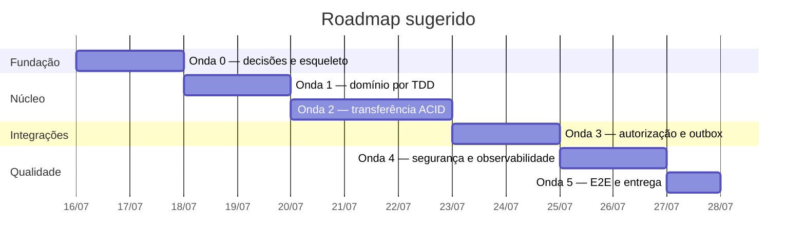

# Roadmap e Backlog

## 1. Estratégia de entrega

O trabalho segue **walking skeleton → domínio → transação → integrações → hardening**. Cada onda termina em software executável; nenhuma fase deixa testes ou segurança para o final.

Estimativas são relativas e servem para planejamento, não como compromisso de prazo: `P` até 2h, `M` até 4h, `G` até 1 dia. Uma pessoa experiente pode concluir o MVP em aproximadamente 8–12 dias úteis, variando conforme familiaridade com a stack.

## 2. Roadmap por ondas



| Onda | Saída verificável | Gate de saída |
|---|---|---|
| 0 | projeto compila, container sobe, migrations rodam | smoke verde |
| 1 | domínio completo sem framework | 100% no domínio crítico |
| 2 | endpoint movimenta PostgreSQL atomicamente | rollback e concorrência verdes |
| 3 | autorização resiliente e notificação eventual | contratos e recovery verdes |
| 4 | telemetria, threat controls e CI completo | todos os quality gates verdes |
| 5 | demo reproduzível e runbook ensaiado | E2E limpo em CI |

## 3. Definition of Ready

Uma história pode iniciar quando possui:

- objetivo e regra de negócio identificados;
- critérios de aceite testáveis;
- contrato de entrada/saída ou decisão explícita de não haver contrato;
- dependências conhecidas e disponíveis via stub;
- estratégia de teste e dados necessários;
- riscos de segurança/concorrência levantados.

## 4. Definition of Done

Uma história só termina quando:

- critérios de aceite estão automatizados;
- TDD foi aplicado e testes negativos/limites existem;
- cobertura global e do módulo permanecem acima dos gates;
- análise estática, arquitetura, SCA e secret scan passam;
- migrations têm rollback operacional documentado, quando aplicável;
- OpenAPI, ADR, runbook e matriz de rastreabilidade foram atualizados;
- logs, métricas e erros não expõem PII;
- PR revisado, sem TODO órfão e executável via Docker.

## 5. Backlog priorizado

### Épico E0 — Fundação executável

**US-001 — Como pessoa desenvolvedora, quero um ambiente reproduzível para validar a solução sem configuração manual.**

Critérios de aceite:

- build determinístico com Java 25 LTS, Spring Boot 4.1.x e Gradle Wrapper 9.x;
- API e PostgreSQL sobem com `docker compose up --build --wait`;
- migrations rodam automaticamente;
- readiness só fica saudável após banco disponível;
- configuração vem de ambiente, sem secrets versionados.

| ID | Tarefa | Tam. | Dependência |
|---|---|---:|---|
| T-001 | criar projeto Gradle e módulos/pacotes hexagonais | M | — |
| T-002 | configurar conventions, formatter e análise estática | M | T-001 |
| T-003 | criar Dockerfile multi-stage, usuário não-root e healthcheck | M | T-001 |
| T-004 | criar Compose com API, PostgreSQL e stubs WireMock | M | T-003 |
| T-005 | configurar profiles `local`, `test` e `prod` | P | T-001 |
| T-006 | adicionar teste ArchUnit para direção das dependências | P | T-001 |

### Épico E1 — Domínio financeiro

**US-101 — Como plataforma, quero representar dinheiro e carteiras com invariantes para impedir estados inválidos.**

Critérios de aceite:

- valor não aceita zero, negativo ou mais de duas casas;
- débito nunca deixa saldo negativo;
- merchant não pode ser pagador;
- transferência cria um débito e um crédito equivalentes.

| ID | Tarefa | Tam. | Dependência |
|---|---|---:|---|
| T-101 | testar e implementar `Money` com `BigDecimal` | M | T-001 |
| T-102 | testar e modelar `User`, tipos, status e fixtures | M | T-101 |
| T-103 | testar e implementar `TransferCommand` e IDs | P | T-101 |
| T-104 | testar e implementar `TransferPolicy` | M | T-102, T-103 |
| T-105 | testar e implementar débito/crédito em `Wallet` | M | T-101, T-102 |
| T-106 | testar e implementar `Transfer` e par de ledger | M | T-104, T-105 |

### Épico E2 — Contrato HTTP

**US-201 — Como cliente, quero solicitar uma transferência e receber uma resposta previsível.**

Critérios de aceite:

- payload oficial funciona sem headers adicionais;
- payload inválido retorna `400` e violações por campo;
- regras retornam códigos estáveis e Problem Details;
- respostas não incluem stack trace ou dados sensíveis.

| ID | Tarefa | Tam. | Dependência |
|---|---|---:|---|
| T-201 | validar OpenAPI em lint e gerar teste de conformidade | M | T-001 |
| T-202 | implementar DTO, mapper e `POST /transfer` por testes web slice | M | T-103 |
| T-203 | implementar catálogo de erros e Problem Details | M | T-202 |
| T-204 | implementar header, hash canônico, replay terminal e in-flight | G | T-202, T-103 |
| T-205 | limitar tamanho do body e normalizar correlation ID | P | T-202 |

### Épico E3 — Persistência e atomicidade

**US-301 — Como plataforma, quero movimentar saldos de forma atômica e auditável.**

Critérios de aceite:

- duas carteiras são bloqueadas em ordem canônica;
- débito, crédito, transferência, ledger, outbox e idempotência fazem commit juntos;
- qualquer falha faz rollback integral;
- concorrência não causa saldo negativo;
- migrations e constraints funcionam em PostgreSQL real.

| ID | Tarefa | Tam. | Dependência |
|---|---|---:|---|
| T-301 | criar migrations, repositories e testes Testcontainers | G | T-004, T-102 |
| T-302 | declarar portas e implementar preflight de usuários/carteiras | M | T-104, T-301 |
| T-303 | implementar unit of work, trigger diferido e rollback por etapa | G | T-106, T-301 |
| T-304 | implementar locks ordenados e testes concorrentes repetíveis | G | T-303 |
| T-305 | persistir outbox na mesma transação e testar atomicidade | M | T-303 |
| T-306 | implementar claim/lease/retry/DLQ do worker | G | T-305 |
| T-307 | persistir estados FINAL/RETRYABLE, lease, claim e replay concorrente | G | T-204, T-301 |
| T-308 | implementar query/job de reconciliação e métrica de divergência | M | T-303 |

### Épico E4 — Serviços externos e resiliência

**US-401 — Como plataforma, quero falhar com segurança quando terceiros estiverem instáveis.**

Critérios de aceite:

- autorização negada ou indisponível não movimenta dinheiro;
- parser rejeita schema inesperado;
- timeout e circuit breaker limitam impacto;
- notificação repete falhas transitórias e não reverte pagamento.

| ID | Tarefa | Tam. | Dependência |
|---|---|---:|---|
| T-401 | implementar adapter do autorizador com WireMock, timeout e circuit | G | T-302 |
| T-402 | implementar adapter do notificador com classificação de erros | M | T-306 |
| T-403 | integrar caso de uso completo e persistir resposta idempotente | G | T-303, T-307, T-401 |
| T-404 | instrumentar clientes com métricas, traces e redaction | M | T-401, T-402 |
| T-405 | criar stubs locais versionados para todos os contratos | P | T-401, T-402 |

### Épico E5 — Qualidade, CI/CD e entrega

**US-501 — Como equipe, quero bloquear regressões automaticamente antes do merge.**

Critérios de aceite:

- pull request executa testes, cobertura, lint, arquitetura e scans;
- cobertura de linhas e branches é ≥ 95%;
- imagem só é publicada a partir da branch principal/tag;
- E2E executa em ambiente efêmero.

| ID | Tarefa | Tam. | Dependência |
|---|---|---:|---|
| T-501 | criar smoke/E2E com Compose e relatório de falha | G | T-403, T-405 |
| T-502 | configurar JaCoCo com gates global e por pacote | P | T-001 |
| T-503 | configurar PIT para domínio crítico e baseline de 80% | M | T-106 |
| T-504 | configurar CodeQL/SAST, dependency, secret e Trivy scans | M | T-003 |
| T-505 | criar smoke de carga k6 e orçamento de performance | M | T-501 |
| T-506 | criar workflows PR, main e release com cache seguro | G | T-501–T-505 |
| T-507 | gerar SBOM, assinar imagem e publicar provenance | M | T-506 |

### Épico E6 — Segurança

**US-601 — Como responsável pela plataforma, quero reduzir abuso e exposição de dados.**

Critérios de aceite:

- entrada tem limites estritos;
- logs omitem/mascaram PII e secrets;
- container roda sem root e com filesystem somente leitura quando possível;
- rate limit e headers seguros estão ativos;
- threat model tem controle/teste para riscos altos.

| ID | Tarefa | Tam. | Dependência |
|---|---|---:|---|
| T-601 | implementar limites de request, rate limit e timeouts de servidor | M | T-202 |
| T-602 | implementar redaction e testes de ausência de PII nos logs | M | T-203 |
| T-603 | endurecer container, rede, headers e TLS de produção | M | T-003 |
| T-604 | validar queries parametrizadas e permissões mínimas no banco | P | T-301 |
| T-605 | automatizar atualização de dependências e política de patches | P | T-504 |

### Épico E7 — Operação e documentação

**US-701 — Como operação, quero detectar, diagnosticar e recuperar falhas com segurança.**

Critérios de aceite:

- dashboards cobrem tráfego, erros, latência, saturação e negócio;
- alertas possuem runbook;
- outbox morta pode ser consultada e reprocessada com auditoria;
- restore e rollback de aplicação são ensaiados.

| ID | Tarefa | Tam. | Dependência |
|---|---|---:|---|
| T-701 | configurar backup/PITR e ensaiar restore | G | T-301 |
| T-702 | criar dashboards e alertas de SLO/outbox/reconciliação | G | T-404 |
| T-703 | implementar comando administrativo auditado para replay | M | T-306 |
| T-704 | validar runbooks com game day de autorizador e banco | G | T-501, T-701, T-702 |
| T-705 | revisar README, OpenAPI, diagramas e roteiro de demo | M | todas MVP |

## 6. Caminho crítico do MVP

```text
T-001 → T-101 → T-102/T-103 → T-104/T-105 → T-106
      → T-301 → T-303 → T-304/T-305/T-307
      → T-302 → T-401 → T-403 → T-501 → T-506
```

Segurança, documentação e cobertura acompanham cada tarefa; não são uma fase opcional.

## 7. Priorização de corte

Se houver restrição severa de tempo, preservar nesta ordem:

1. regras de domínio e atomicidade;
2. endpoint oficial e tratamento de erros;
3. autorização externa com timeout;
4. testes de concorrência e rollback;
5. outbox e retry de notificação;
6. Docker, CI e documentação;
7. idempotência, ledger/reconciliação e telemetria avançada.

Mesmo no corte mínimo, notificação deve ser desacoplada do commit e o código precisa explicar claramente o débito técnico restante.

## 8. Riscos de execução

| Risco | Prob. | Impacto | Mitigação |
|---|---:|---:|---|
| mocks públicos indisponíveis | alta | alto | WireMock local; CI nunca chama internet |
| cobertura de 95% vira teste superficial | média | alto | mutation testing e review de asserts |
| deadlock/flakiness em concorrência | média | alto | locks ordenados, latches e PostgreSQL real |
| escopo excessivo atrasa fluxo principal | média | alto | monólito, sem auth/cadastro/Kafka no MVP |
| segredo/PII em logs | média | alto | allowlist de campos e teste de redaction |
| dependência vulnerável | média | médio | SCA, SBOM e atualização automática |
